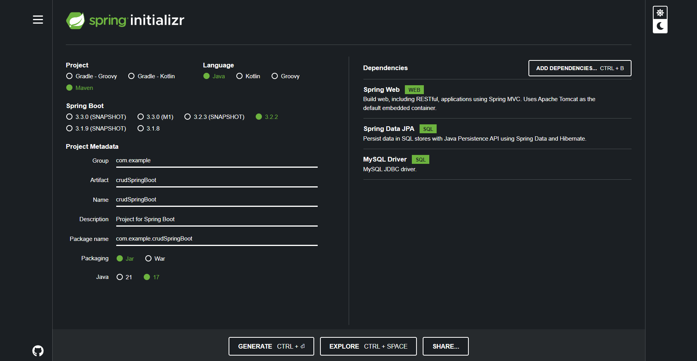

# API Rest - Spring Boot (v3.2.2)- Java

  .   ____          _            __ _ _
 /\\ / ___'_ __ _ _(_)_ __  __ _ \ \ \ \
( ( )\___ | '_ | '_| | '_ \/ _` | \ \ \ \
 \\/  ___)| |_)| | | | | || (_| |  ) ) ) )
  '  |____| .__|_| |_|_| |_\__, | / / / /
 =========|_|==============|___/=/_/_/_/




`mvn spring-boot:run`


ejemplo para correr spring-boot con maven:
```
C:\....\varios-Java\API_Rest_SpringBoot\crudSpringBoot> mvn spring-boot:run
```